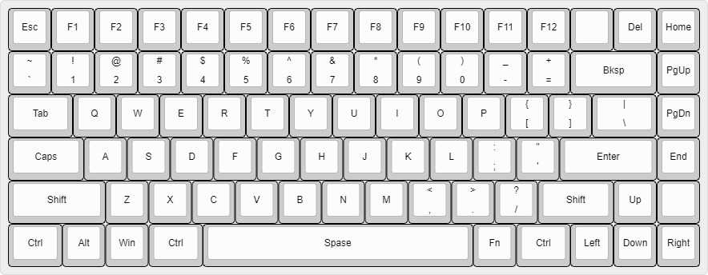
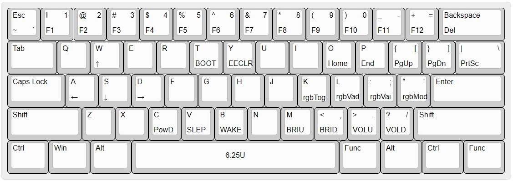

## ginpun

> 即：键盘（粤语）

偶然看到开源键盘库 [system76/launch](https://github.com/system76/launch) ，受其启发，故折腾起键盘。

目前有三款（[KB84](kb84/)、[SG_V1](sg_v1/)、[SG_V2](sg_v2/)）键盘，都是基于 ATmega 32U4 的。

更便宜一些的 ATmega 32A 的引导程序和最小系统也有提供，但是经过开发板打样测试，32A 的性能对于运行 QMK 来说还是捉襟见肘的，可玩性稍低一些。

例如：

- 在显示“从右向左”的五彩灯效时，会有停顿。
- 由于不支持 USB，通过 V-USB 实现的 USB，也不可以实现全键无冲。

## KB84

[KB84 于立创开源社区的链接](https://oshwhub.com/lipk/keyboard_1)

按键布局基于 system76 的 [launch](https://system76.com/accessories/launch) 键盘。由于特殊设计的按键配列，键帽非常难买到，键帽高度只能买到 XDA 的，可玩性不高。

### SG_V1

类标准 84 配列。

主要特点是第 6 行，“空格”键居中，有一个 1.5U 的 “CTRL” 靠近 “Z”、“X”、“C”、“V”，方便使用快捷键，所以键帽购买时也是稍微需要注意的。

.jpg)

### SG_V2

标准 87 配列，去掉右侧方向键和功能键，再去掉 F 区就是 SG_V2 的配列了。

由于是在“标准 87 配列”的基础上做删减，所以直接买 87 配列的键帽就好了，可玩性很高。

另外，此键盘使用 gasket 结构设计，而且使用磁吸安装，不需要一颗螺丝。

注：F 区，和方向键、功能键都在第 2 层，只要按一下功能键就可以切换到第 2 层了，不会有按键不够用的苦恼。

